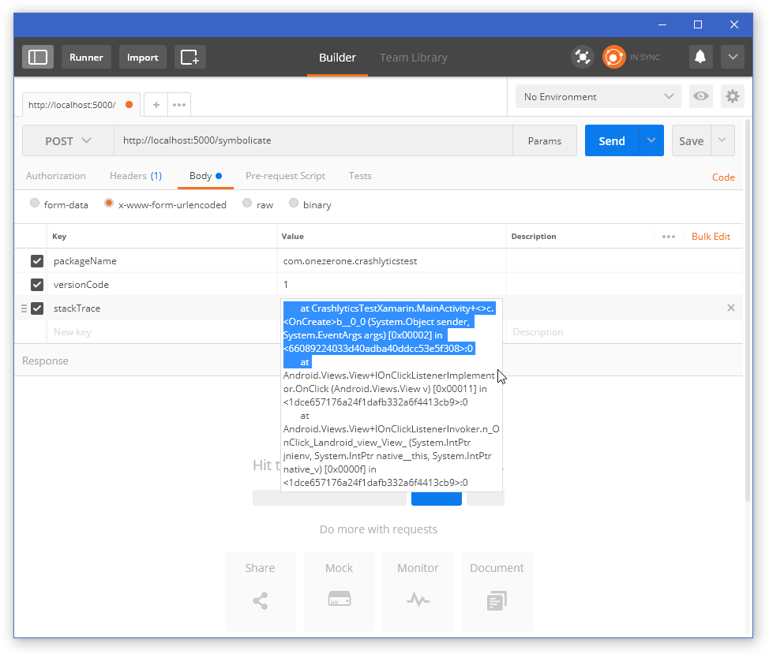
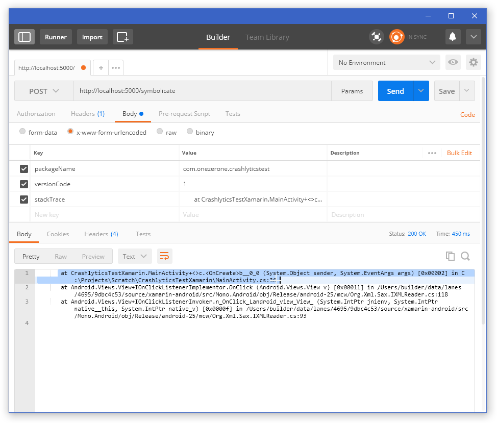

# MonoSymbolicateHelper

This project will help de-obfuscate stack traces to meaningful ones using 
the `mono-symbolicate` tool. It consists of a local server and a Chrome
extension.

## Configuration

Build the solution, then edit the `MonoSymbolicateHelper.Service.exe.config` file.

Make sure you update the paths to the `archivePath` (where Xamarin builds your app archive) as well as the path to `mono-symbolicate`.

The default port for the service is 5000, but you can update it in the config file.

## Using the helper

Launch the helper service. By default, it will open in a console window and will start listening to requests on port 5000 (or whichever port you configured). 

You can also install this as a Windows service using the `install` command. See [Topshelf Command Line Reference](http://docs.topshelf-project.com/en/latest/overview/commandline.html).

Use a tool like [Postman](https://chrome.google.com/webstore/detail/postman/fhbjgbiflinjbdggehcddcbncdddomop?hl=en) or [Advanced REST Client](https://chrome.google.com/webstore/detail/advanced-rest-client/hgmloofddffdnphfgcellkdfbfbjeloo?hl=en) to send requests to the helper service.

Sent POST requests to http://localhost:5000/symbolicate

Use type `x-www-form-urlencoded` and add the following body parameters:

* packageName = com.example.app
* versionCode = 123 *this is the numeric code, not the versionName like 1.2.3*
* stackTrace = \<paste your stack trace here>

Submit your request to the helper service and the response will be the de-obfuscated stack trace.

## Example

### **1. Request setup** *(Note the obfuscated stack trace)*

### **2. Click Send**

### **3. Result** *(You can now see the de-obfuscated stack trace. It will also add line numbers to 3rd party libraries if you have the symbols.)*

## Chrome Extension

I have published a Chrome extension that will automatically capture
the stack trace from HockeyApp.

This extension will grab the stack trace and send it to the helper then update
the existing page with the de-obfuscated stack trace automatically.

You can find it on the [Chrome Web Store](https://chrome.google.com/webstore/detail/monosymbolicatehelper-hoc/jjnnmicghifjnnaecpeamlhpmpleiphb).

## Contact

Let me know if you have any issues getting this working.

